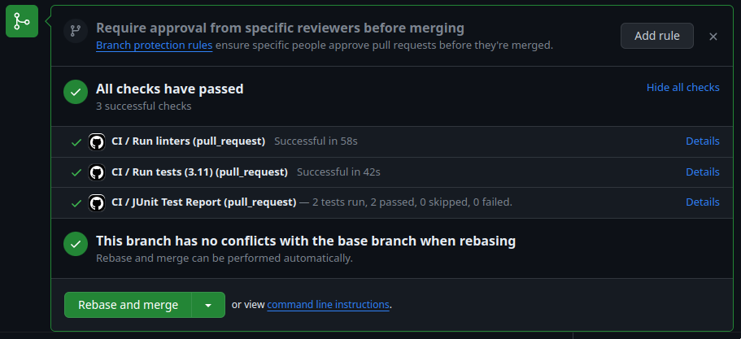
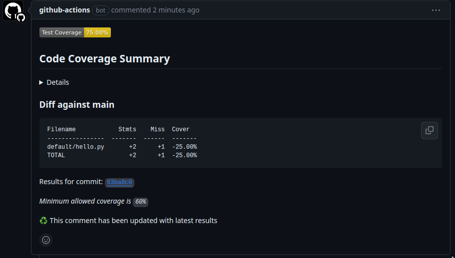
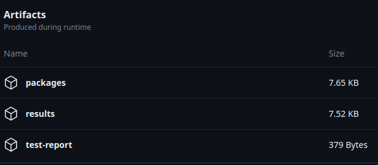
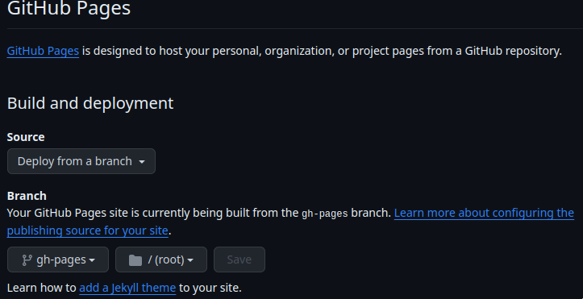

# GitHub Actions CI

This is **optional** template option, which results in `.github` directory creation which contains workflows.

It generates two workflows: one standard CI and second only for building documentation.

## CI Workflow

By default each base branch and pull request will trigger CI workflow.

The workflow is defined in `.github/workflows/ci.yml` file.

It consists of two major jobs:
1. **Run linters**
  - runs `pre-commit` checks to validate formatting, code style, type hints, security and other checks.
  - runs `trivy` to check for security vulnerabilities (will add new comment to PR).
  - checks licenses against list of allowed licenses.
  - generates `pip freeze` to provide reproducible build.
  - validate if python package can be build with thebuild tool.
1. **Run tests**
  - runs `pytest` tests with code coverage (cobertura format).
  - report test results to GitHub (will add new check).
  - report code coverage  (will add new comment to PR).



### Code coverage

Default code coverage recommended setup is one which uses additional branch to track coverage changes and comment on PRs.



### Artifacts

There are generated artifacts which can be downloaded from GitHub UI.




1. **packages**:
    - **dist/** - contains built python package
1. **results**:
    - **trivy-scanning-results.txt** - contains trivy security scan results rendered as ascii table
    - **licenses.txt** - contains dump of libraries with detected licenses
    - **requirements-freeze.txt** - pip freeze to provide reproducible build
1. **test-report**:
    - contains just `report.xml` with results of executed tests

### License validation

We use `pip-licenses` to extract installed packages and obtain license information.

By default, we accept only those selected licenses from `.license-whitelist.txt`. 
Each short license must be in new line and it is matched by checking if string exists in line.

Sometimes there are situations when a license library detection does not work or there is a justified decision
to accept some license - to accept such library edit `.libraries-whitelist.txt`.
All libraries must be put in single line.

```{warning}
`.license-whitelist.txt` must have a license in each distinct line.

`.libraries-whitelist.txt` must be contained in single line (e.g. "foo bar").
```

## GitHub Actions hints

Please get familiar with official documentation before you modify the yaml configuration.

Changing YAML is error-prone so here are protips:

1. Visual Studio Code (and maybe other editors too) have an extension which helps with Github Actions - it can be found [here](https://marketplace.visualstudio.com/items?itemName=cschleiden.vscode-github-actions).
1. Use YAML validator in your editor to fix wrong whitespaces.
1. Operate on branch first or create a temporary test repository.
1. `if` and similar conditions should be added last, after testing a job.

## Documentation workflow

### GitHub Pages

By default **Github Actions** pipelines have `documentation` workflow which will build sphinx documentation automatically on main branch - and it will push it to a branch - it can be hosted on **Github Pages** if you enable it.

To access it, you need to enable it, on **Github repository -> Settings -> Pages** page select **Deploy from a branch** and select **gh-pages**. Link will appear here after deployment.

```{warning}
Only on Github Enterprise you can make it private and limit it to only people with repository access.
```

Please read more about it [here](https://docs.github.com/en/pages/quickstart).

