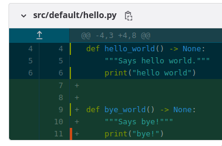
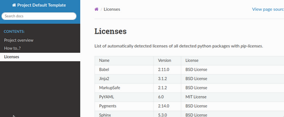

# GitLab CI configuration

This is **optional** cookiecutter template option, which result in `.gitlab-ci.yml` file creation.

File has comments for jobs so it should be relatively easy to understand and adapt.

It generates automated pipeline to ensure code quality, tests and other goodies.

We also optimized the pipeline so it should take 2-4 minutes to run on an empty project.

```{note}
To reduce computations and costs CI is only executed when a developer opens a Merge Request and on a default branch.
Moreover, almost all unfinished jobs can be interrupted by more recent code change.
It is controlled by `interruptible: true` [flag](https://docs.gitlab.com/ee/ci/yaml/).
```

## Context-sensitive stages

### Merge Request

When a developer opens a Merge Request we run linters and tests stages. 

Optionally a development package can be released to PIP registry with a manual trigger.


### Main branch

After merge is concluded, we execute more stages - documentation build & upload to GitLab Pages and option to release non-development package with manual trigger.


### On pre-commit changes

When a `pre-commit` configuration file is changed or `docker/precommit/Dockerfile` additional stage appears - its role is to build and 
upload the docker image to GitLab Container Registry.

This is quite complex due to the need to work with new repository or existing branch and it has to provide bootstrapping for image.


On Merge Request it builds, uploads and tests the image tagged with git commit SHA. 

Default docker name is `precommit` and in `.gitlab-ci.yml` is defined as: `PRECOMMIT_IMAGE: $DOCKER_REGISTRY/precommit`.

On master it does the same but also tags the docker image with `latest` tag.

It takes 3-5 minutes to build a docker image from scratch, future builds should be faster due to docker image caching.

```{warning}
If possible adapt gitlab `linter` tasks to always use a SHA tagged image instead of using `latest` tag - the only
reason we could not do it is due to a need to provide automatic setup without manual intervention.

By using SHA tags, you can simplify `linter` stage and have more reproducible pipelines.

To switch you must replace `precommit:latest` to `precommit:dev-<GIT COMMIT SHA>`.

Commit SHA is the long hash for each git commit, to get one for your current one you can 
use `git rev-parse HEAD`, also GitLab has `$CI_COMMIT_SHA` environment variable.

```

## Stages summary

* **preparation** stage:
    - runs only to bootstrap or update pre-commit docker image
    - it reduces linter stage from ~2 minutes to ~20 seconds on empty project.
* **lint** stage:
    - ensures code style consistency
    - checks for code mistakes
    - provides basic safety checks
    - **see:** {ref}`precommit page <_precommit>`
* **tests** stage:
    - runs `pytest` tests
    - calculates code coverage:
        - 
        - red marks lines not covered by tests, green are covered
        - reports code % coverage
        - 
    - checks for licenses
        - fails if any third-party installed python package license is not present on allowlist (`.license-whitelist.txt`).
    - generates `pip freeze`
    - **artifacts:** exact pinned package versions + licenses can be downloaded from this stage
* **package** stage:
    - builds pip `*.tar.gz` and `*.whl` python packages
    - adds build number to package
* **pages** stage:
    - generates and builds Sphinx documentation
    - scans and generate information table for all used python packages
        -  
* **security** stage:
    - runs `trivy` and fails on critical security vulnerability - required for SOC 2 Certification - do not remove it
    - **artifacts:** json and html generated by trivy
* **deploy** stage - only on **main/master** branch:
    - uploads generated Sphinx docs to `GitLab Pages`. All project members can access it
    - build and upload release (non-development) package to private `GitLab Package Registry`
        -  

## Artifacts


Pipelines and jobs provide a set of artifacts. Aside of required ones for tests/coverage especially interesting are:

1. **tests:archive**
    - **licenses.txt** - contains dump of libraries with detected licenses
    - **requirements-freeze.txt** - pip freeze to provide reproducible build
    - **dist/** - contains built python packages
1. **trivy security scan:archive**:
    - security report in html file
1. **trivy security scan:dependency_scanning**:
    - security report in json file, however it is easier to read job logs

## License check

We use `pip-licenses` to extract installed packages and obtain license information.

By default, we accept only those selected licenses from `.license-whitelist.txt`. 
Each short license must be in new line and it is matched by checking if string exists in line.

Sometimes there are situations when a license library detection does not work or there is a justified decision
to accept some license - to accept such library edit `.libraries-whitelist.txt`.
All libraries must be put in single line.

```{warning}
`.license-whitelist.txt` must have a license in each distinct line.

`.libraries-whitelist.txt` must be contained in single line (e.g. "foo bar").
```

## GitLab details

Please get familiar with official documentation before you modify the yaml configuration.

Changing YAML is error-prone so here are protips:

1. Use YAML validator in your editor to fix wrong whitespaces.
1. Operate on branch first or create a temporary test repository.
1. Use GitLab [validator & simulator](https://docs.gitlab.com/ee/ci/lint.html)
1. `if` and similar conditions should be added last, after testing a job.

### GitLab Pages

GitLab Pages is static hosting solution which is used to host documentation.

```{warning}
Name `pages` for job name and stage is important! Changing this name will break GitLab feature to automatically upload and host documentation.
```

```{note}
Due to using `deepsense.ai` there is always error raised by browsers due to certificate not covering the subdomain. This is known issue due to "." appear in name.

There is no known workaround, except user accepting and adding exception for it.
```

### GitLab Package Registry

All master and merge requests are set to manual trigger to build and upload python pip package to the related private repository.

Essential read is [GitLab documentation](https://docs.gitlab.com/ee/user/packages/package_registry/).

```{tip}

It can be also customized to adapt `bump2config` to tag and make GitLab to release a new package on git tag event.
Check also {ref}`packaging page <_packaging_semver>`.

Some projects might benefit from switching to automatic uploads instead of manual.
```

### GitLab Docker Registry

By default we use it for `pre-commit` docker image - so each project can have it's own. 

There is also a **company-wide [docker registry](http://docker.intra.deepsense.ai/)**. Ask IT about it.

### Other GitLab featurs

The template targets only GitLab **free** mode which is limiting many functionalities.

